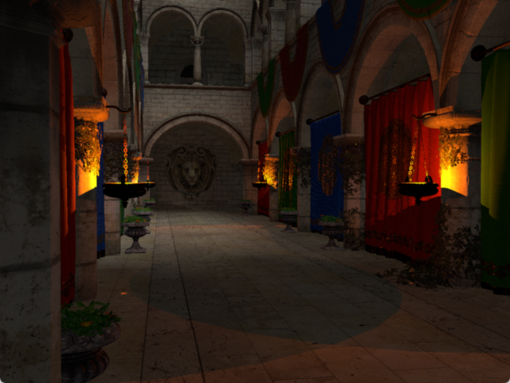
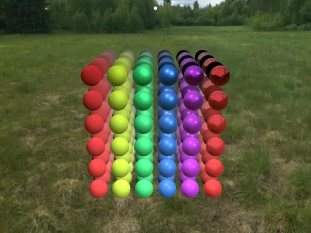

<h1 align="center"><br>Pygfx</h1>

[
](https://github.com/pygfx/pygfx/actions)
[
](https://docs.pygfx.org)
[
](https://badge.fury.io/py/pygfx)

Pygfx' purpose is to bring powerful and reliable visualization to the Python world. 🚀

Pygfx (pronounced "py-graphics") is built on [wgpu](https://github.com/pygfx/wgpu-py/), enabling superior performance and reliability compared to OpenGL-based solutions. It is designed for simplicity and versatility: with its modular architecture, you can effortlessly assemble graphical scenes for diverse applications, from scientific visualization to video game rendering.

<p align="center">



</p>
<p align="center">
[<a href="https://docs.pygfx.org/stable/guide.html">User Guide</a>]
[<a href="https://docs.pygfx.org/stable/_gallery/index.html">Example Gallery</a>]
[<a href="https://docs.pygfx.org/stable/reference.html">API Reference</a>]
</p>

## Professional support

Need help? We offer the following professional services:

* **Priority Support:** Rest assured with our dedicated support, prioritizing your needs for quick issue resolution and feature implementation.
* **Integration Support:** Get assistance with integrating Pygfx into your application, ensuring a smooth transition and optimal performance.
* **Customized Solutions:** Whether it's crafting specific visualizations or developing shaders, we work closely with you to create tailored solutions that address your unique requirements.
* **Training and Workshops:** We provide informative training sessions and workshops aimed at boosting skills and knowledge.

Also checkout the [sponsors page](https://github.com/sponsors/pygfx).
For further inquiries reach out to us at [support@pygfx.org](mailto:support@pygfx.org).

## Installation

```bash
pip install -U pygfx glfw
```

To work correctly, Pygfx needs _some_ window to render to. Glfw is one
lightweight option, but there are others, too. If you use a different
wgpu-compatible window manager or only render offscreen you may choose to omit
glfw. Examples of alternatives include: `jupyter_rfb` (rendering in Jupyter),
`PyQt`, `PySide`, or `wx`.

In addition there are some platform
requirements, see the [wgpu docs](https://wgpu-py.readthedocs.io/en/stable/start.html). In
essence, you need modern (enough) graphics drivers, and `pip>=20.3`.

## Status

We're currently working towards version `1.0`, which means that the API
can change with each version. We expect to reach `1.0` near the end of
2024, at which point we start caring about backwards compatibility.

This means that until then, you should probably pin the Pygfx version
that you're using, and check the [release notes](https://github.com/pygfx/pygfx/releases)
when you update.

## Usage Example

> **Note**
> The example below is designed against the `main` branch,
> and may not work on the latest release from pypi, while we're in beta.

> **Note**
> A walkthrough of this example can be found in [the
> guide](https://docs.pygfx.org/stable/guide.html#how-to-use-pygfx).

```python
import pygfx as gfx
import pylinalg as la

cube = gfx.Mesh(
    gfx.box_geometry(200, 200, 200),
    gfx.MeshPhongMaterial(color="#336699"),
)

rot = la.quat_from_euler((0, 0.01), order="XY")

def animate():
    cube.local.rotation = la.quat_mul(rot, cube.local.rotation)

if __name__ == "__main__":
    gfx.show(cube, before_render=animate)

```


## Feature Highlights
Some of Pygfx's key features are:

- SDF based text rendering ([example](
  https://docs.pygfx.org/stable/_gallery/feature_demo/text_contrast.html))
- order-independent transparency (OIT) ([example](
  https://docs.pygfx.org/stable/_gallery/feature_demo/transparency2.html))
- lights, shadows, and physically based rendering (PBR) ([example](
  https://docs.pygfx.org/stable/_gallery/feature_demo/pbr.html))
- event system with built-in picking ([example](
  https://docs.pygfx.org/stable/_gallery/feature_demo/picking_points.html))
- texture and color mapping supporting 1D, 2D and 3D data ([example](
  https://docs.pygfx.org/stable/_gallery/feature_demo/colormap_channels.html))


And many more! Check out our [feature demos](
https://docs.pygfx.org/stable/_gallery/index.html) in the docs.

## License

Pygfx is licensed under the [BSD 2-Clause "Simplified" License](LICENSE). This means:

- :white_check_mark: It is free (and open source) forever. :cupid:
- :white_check_mark: You _can_ use it commercially.
- :white_check_mark: You _can_ distribute it and freely make changes.
- :x: You _can not_ hold us accountable for the results of using Pygfx.

## Contributing

See [CONTRIBUTING.md](CONTRIBUTING.md).

### Development Install
To get a working dev install of Pygfx you can use the following steps:

```bash
# Click the Fork button on GitHub and navigate to your fork
git clone <address_of_your_fork>
cd pygfx
# if you use a venv, create and activate it
pip install -e ".[dev,docs,examples]"
pytest tests
```

### Testing

The test suite is divided into three parts; unit tests for the core, unit
tests for the examples, and screenshot tests for the validation examples.

* `pytest -v tests` runs the core unit tests.
* `pytest -v examples` tests the examples.

The screenshot tests are difficult to guarantee across all development
platforms and are best run on our CI where more predictable outcomes can be
achieved. They can run on a local linux machine by selecting the software
rendering adapter and the tests with the command

* `PYGFX_WGPU_ADAPTER_NAME=llvmpipe pytest examples -k test_examples_compare`

Note that our `pytest.ini` file contains the environment variable
`PYGFX_DISABLE_SYSTEM_FONTS=1` to help ensure consistency across system
installations.


### Code of Conduct

Our code of conduct can be found here: [Code of Conduct](./CODE_OF_CONDUCT.md)


## Spelling and pronunciation

Lowercase "pygfx" is used in code. You can refer to the project in written text using "Pygfx".
Pygfx is pronounced as *pie-graphics*.
