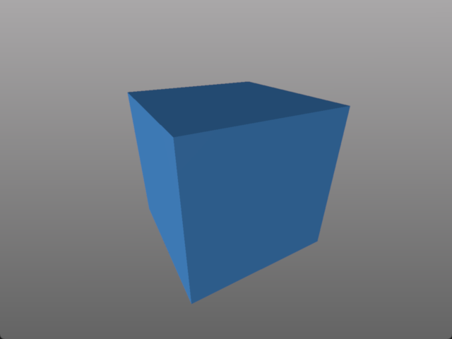
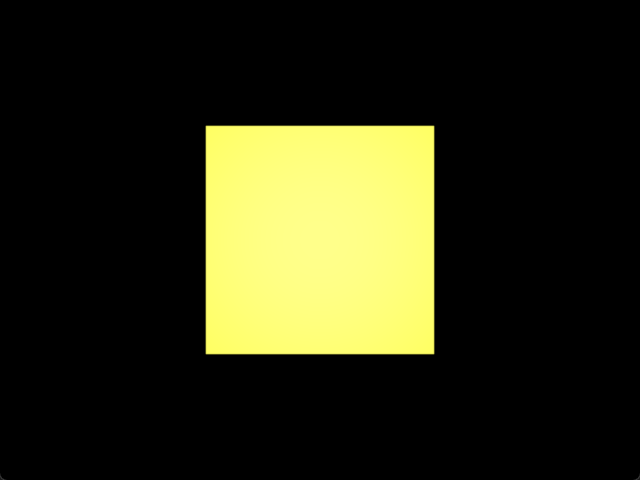

===============
The Pygfx guide
===============

Installation
------------

To install use your favourite package manager, e.g.:

.. code-block::

    pip install -U pygfx

For Pygfx to work, the appropriate GPU drivers should be installed.

* Windows: On Windows 10 and up, you should be ok. If your machine has a dedicated GPU, consider updating your (Nvidia or AMD) drivers.
* MacOS: Need at least 10.13 (High Sierra) to use Metal (Apple's GPU driver).
* Linux: On a modern Linux desktop you should be fine. Maybe ``apt install mesa-vulkan-drivers``.
  For details see https://wgpu-py.readthedocs.io/en/stable/start.html#linux.

What is Pygfx?
--------------

Pygfx is a render engine. It renders objects that are organized in a scene, and
provides a way to define what the appearance of these objects should be.
For the actual rendering, multiple render backends are available, but the
main one is based on WGPU.

The `WGPU <https://github.com/pygfx/wgpu-py>`_ library provides the low level API to
communicate with the hardware. WGPU is itself based on Vulkan, Metal and DX12.

How to use Pygfx?
-----------------

Before jumping into the details, here is a minimal example of how to use the
library::

    import pygfx as gfx

    cube = gfx.Mesh(
        gfx.box_geometry(200, 200, 200),
        gfx.MeshPhongMaterial(color="#336699"),
    )

    if __name__ == "__main__":
        gfx.show(cube)

And with that we rendered our first scene using wgpu! Simple, right? At the same
time, this is just scratching the surface of what we can do with Pygfx and next
up we will have a look at the three main building blocks involved in creating
more complex rendering setups: (1) `Scenes`, (2) `Canvases`, and (3)
`Renderers`.

**Scenes**

Starting off with the most important building bock, a `Scene` is the world or
scenario to render. It has at least three components: an `object` with some
visual properties, a `Light` source, and a `Camera` to view the scene. Once we
defined those three things, we can position them within our scene and render it.

Let's look at an example of how this works and recreate the above example. We
begin by defining an empty `Scene`::

    import pygfx as gfx

    scene = gfx.Scene()

Right now this scene is very desolate. There is no light, no objects, and
nothing that can look at those objects. Let's change this by adding some
`light` and creating a `camera`::

    # and god said ...
    scene.add(gfx.AmbientLight())
    scene.add(gfx.DirectionalLight())

    camera = gfx.PerspectiveCamera(70, 16 / 9)
    camera.local.z = 400

Now there is light and a camera to perceive the light. To complete the setup
we also need to add an object to look at::

    geometry = gfx.box_geometry(200, 200, 200)
    material = gfx.MeshPhongMaterial(color="#336699")
    cube = gfx.Mesh(geometry, material)
    scene.add(cube)

Objects are slightly more complicated than lights or cameras. They have a
`geometry`, which controls an object's form, and a `material`, which controls an
object's appearance (color, reflectiveness, etc). From here, we can hand our
result to `gfx.show` and visualize it. This time, however, we are passing a `Scene`
instead of an `Object`, so the result will look a little different::

    gfx.show(scene)

This happens because a complete `Scene` can be rendered as-is, whereas an
`Object` can not. As such, `gfx.show` will, when given an `Object`, create a new
scene for us, add the missing lights, a camera, and a background (for visual
appeal), place the object into the scene and then render the result. When given
a `Scene`, on the other hand, it will use the input as-is, allowing you to see
exactly what you've created and potentially spot any problems.

**Canvases**

The second main building block is the `Canvas`. A `Canvas` provides the surface
onto which the scene should be rendered, and to use it we directly import it
from wgpu-py (on top of which Pygfx is built). Wgpu-py has several canvases that
we can choose from, but for starters the most important one is ``auto``, which
automatically selects an appropriate backend to create a window on your screen::

    import pygfx as gfx
    from rendercanvas.auto import RenderCanvas

    canvas = RenderCanvas(size=(200, 200), title="A cube!")
    cube = gfx.Mesh(
        gfx.box_geometry(200, 200, 200),
        gfx.MeshPhongMaterial(color="#336699"),
    )

    if __name__ == "__main__":
        gfx.show(cube, canvas=canvas)

Like before, ``gfx.show`` will automatically create a canvas if we don't provide
one explicitly. This works fine for quick visualizations where the render can
appear as a standalone window. However, if we want to have more fine-grained
control over the target, e.g., because we want to change the window size or
title, we need specify the canvas explicitly. Another common use-case for an
explicit canvas is because we are creating a larger GUI and we want the render
to only appear in a subwidget of the full window.

**Renderers**

The third and final main building block is a `Renderer`. A `Renderer` is like an
artist that brings all of the above together. It looks at the `Scene` through a
`Camera` and draws what it sees onto the surface provided by the `Canvas`. Like
any good artist, a `Renderer` is never seen without its `Canvas`, so to create a
`Renderer` we also need to create a `Canvas`::

    import pygfx as gfx
    from rendercanvas.auto import RenderCanvas

    canvas = RenderCanvas()
    renderer = gfx.renderers.WgpuRenderer(canvas)

    cube = gfx.Mesh(
        gfx.box_geometry(200, 200, 200),
        gfx.MeshPhongMaterial(color="#336699"),
    )

    if __name__ == "__main__":
        gfx.show(cube, renderer=renderer)

The output is the same as without the explicit reference because `gfx.show`
will, as you may expect at this point, create a renderer if we don't provide it.
For many applications this is perfectly fine; however, if we want to tackle more
advanced problems (e.g., control the exact process on how objects appear to
overlay each other) we may need to create it explicitly. For starters, it is
enough to know that it exists and what it does, so that we can come back to it
later when it becomes relevant.

Animations
----------

Static renders are nice, but you know what is better? Animations! As mentioned
in the section on `Canvases`, this is done via a backend's event loop which
allows you to specify callbacks that get executed periodically. For convenience,
`gfx.show` exposes two callbacks that will be executed before a new render is
made (`before_render`) and afterward (`after_render`). To animate a scene,
simply pass a callback to this function (here ``animate``) and use it to modify
the scene as desired::

    import pygfx as gfx
    import pylinalg as la

    cube = gfx.Mesh(
        gfx.box_geometry(200, 200, 200),
        gfx.MeshPhongMaterial(color="#336699"),
    )

    rot = la.quat_from_euler((0, 0.01), order="XY")

    def animate():
        cube.local.rotation = la.quat_mul(rot, cube.local.rotation)

    if __name__ == "__main__":
        gfx.show(cube, before_render=animate)

.. image:: _static/guide_rotating_cube.gif

Buffers and textures
--------------------

Buffers and textures represent data that lives on the GPU. They are used to e.g.
represent positions, normals, images, colormaps, and all other "arrays" that the GPU need to do the work.
These low-level objects are attached to geometries and materials (discussed below).

A :class:`~pygfx.resources.Buffer` represents a one dimensional array and is used to contain e.g. positions and per-point colors.
A :class:`~pygfx.resources.Texture` represents a 1D, 2D or 3D array and is used to contain e.g. image data and colormaps.

The data of a buffer or tetxure can be updated and re-synced with the GPU, making it possible
to change the visualization in real time, for eample in animations and user interactions.

World objects
-------------

We've briefly mentioned world objects, materials, and geometry. But how do these relate?

A world object represents an object in the world. It has a transform, by which the
object can be positioned (translated, rotated, and scaled), and has a visibility property.
These properties apply to the object itself as well as its children (and their children, etc.).

All objects that have an appearance in the scene are world objects. But there
are also helper objects, lights, and cameras. These are all world objects.

**Geometry**

Most world objects have a geometry. This geometry object contains the
data that defines (the shape of) the object, such as positions, plus
data associated with these positions (normals, texcoords, colors, etc.).
Multiple world objects may share a geometry.

**Materials**

All world objects that have an appearance, have a material that defines
that appearance. (Objects that do not have an appearance are for example
groups or cameras.) For each type of object there are typically a few
different material classes, e.g. for meshes you have a
``MeshBasicMaterial`` that is not affected by lights, a
``MeshPhongMaterial`` that applies the Phong light model, and the
``MeshStandardMaterial`` that implements a physically-based light model.
Materials also have properties to tune things like color,
line thickness, colormap, etc. Multiple world objects may share the same material
object, so their appearance can be changed simultaneously.

Performance tip: changing the material on a world object incurs some
overhead for creating the low-level wgpu objects. However, switching
to a material that was already used (with that object) has zero
overhead.

Cameras and controllers
-----------------------

We've already been using cameras, but let's look at them a bit closer!

**Perspective camera**

There are two main cameras of interest. The first is the :class:`~pygfx.cameras.PerspectiveCamera`,
which is a generic camera intended for 3D content. You can instantiate one
like this:

.. code-block:: python

    camera = gfx.PerspectiveCamera(50, 4/3)

The first argument is the fov (field of view) in degrees. This is a
value between 0 and 179, with typical values < 100. The second argument
is the aspect ratio. A window on screen is usually a rectangle with 4/3
or 16/9 aspect. The aspect can be set so the contents better fit the
window. When the fov is zero, the camera operates in orthographic mode.

**Orthographic camera**

The second camera of interest is the :class:`~pygfx.cameras.OrthographicCamera`. Technically
it's a perspective camera with the fov fixed to zero. It is also instantiated differently:

.. code-block:: python

    camera = gfx.OrthographicCamera(500, 400, maintain_aspect=False)

The first two arguments are the `width` and `height`, which are
typically used to initialize an orthographic camera. This implicitly
sets the aspect (which is the width divided by the height). The
`maintain_aspect` argument can be set to False if the dimensions do not
represent a physical dimension, e.g. for plotting data. The contents
of the view are then stretched to fill the window.

**Orienting cameras**

Camera's can be oriented manually by setting their position, and then set their rotation
to have them look in the correct direction, e.g. using :func:`.look_at()<pygfx.WorldObject.look_at>`.
In this case you should probably set the width in addition to fov and aspect.

.. code-block:: python

    # Manual orientation
    camera = gfx.PerspectiveCamera(50, 4/3, width=100)
    camera.local.position = (30, 40, 50)
    camera.look_at((0, 0, 0))

However, we strongly recommend using one of the ``show`` methods, since these
also set the ``width`` and ``height``. Therefore they better prepare the
camera for controllers, and the near and far clip planes are
automatically set.

.. code-block:: python

    # Create a camera, in either way
    camera = gfx.PerspectiveCamera(50, 4/3)
    camera = gfx.OrthographicCamera()

    # Convenient orientation: similar to look_at
    camera.local.position = (30, 40, 50)
    camera.show_pos((0, 0, 0))

    # Convenient orientation: show an object
    camera.show_object(target, view_dir=(-1, -1, -1))

    # Convenient orientation: show a rectangle
    camera.show_rect(0, 1000, -5, 5, view_dir=(0, 0, -1))

The :func:`.show_pos()<pygfx.cameras.PerspectiveCamera.show_pos>` method
is the convenient alternative for ``look_at``. Even easier is using
:func:`.show_object()<pygfx.cameras.PerspectiveCamera.show_object>`, which allows
you to specify an object (e.g. the scene) and optionally a direction.
The camera is then positioned and rotated to look at the scene from the given direction.
A similar method, geared towards 2D data is :func:`.show_rect()<pygfx.cameras.PerspectiveCamera.show_rect>`
in which you specify a rectangle instead of an object.

**The near and far clip planes**

Camera's cannot see infinitely far; they have a near and far clip plane. Only the space
between these planes can be seen. To get a bit more technical, this space is mapped
to a value between 0 and 1 (NDC coordinates), and this is converted to a depth value.
Since the number of bits for depth values is limited, it's important for the near
and far clip planes to have reasonable values, otherwise you may observe "z fighting",
or objects may simply not be visible.

If you use the recommended ``show`` methods mentioned above, the near
and far plane are positioned about 1000 units apart, scaled with the
mean of the camera's width and height. If needed, the clip planes can be
specified explicitly using the ``depth_range`` property.

**Controlling the camera**

A controller allows you to interact with the camera using the mouse. You simply
pass the camera to control when you instantiate it, and then make it listen to
events by connecting it to the renderer or a viewport.

.. code-block:: python

    controller = gfx.OrbitController(camera)
    controller.add_default_event_handlers(renderer)

There are currently two controllers: the
:class:`~pygfx.controllers.PanZoomController` is for 2D content or in-plane
visualization, and the :class:`~pygfx.controllers.OrbitController` is for 3D
content. All controllers work with both perspective and orthographic cameras.

Updating transforms
-------------------

WorldObjects declare two reference frames that we can use to maneuver them
around: `local` and `world`. `local` allows us to position an object relative to
its parent and `world` allows us to position objects relative to the world's
inertial frame.

.. note::
    Both `local` and `world` declare the same properties, meaning that we
    can express any of the below properties in either frame.

.. code-block:: python

    cube = gfx.Mesh(
        gfx.box_geometry(10, 10, 10),
        gfx.MeshPhongMaterial(color="#808080"),
    )

    cube.world.position = (1, 2, 3)
    cube.world.rotation = la.quat_from_euler(
        (np.pi/2, np.pi/2), order="YX"
    )
    cube.world.scale = (2, 4, 6)
    cube.world.scale = 3  # uniform scale

    # setting components only
    cube.local.x = 1
    cube.local.y = 10
    cube.local.z = 100

    cube.local.scale_x = 2
    cube.local.scale_y = 4
    cube.local.scale_z = 6

.. warning::

    While in-place updating of full properties is supported, in-place updating
    of slices will return an error. This is due to limitations of the python
    programming language and our desire to have the properties return pure numpy
    arrays. The numpy arrays are returned with the WRITEABLE flag set to false.
    In code, this means

    .. code-block:: python

        cube.local.position += (0, 0, 3)  # ok
        cube.local.z += 3  # ok
        # The following two statements will fail with
        # ValueError: assignment destination is read-only.
        cube.local.position[2] += 3  # FAIL: ValueError
        cube.local.position[2] = 3  # FAIL: ValueError

Beyond setting components, we can also set the full ``matrix`` directly::

    cube.world.matrix = la.mat_from_translation((1, 2, 3))

and we can - of course - read each property. To make a full example, we can
create a small simulation of a falling and rotating cube.

.. code-block:: python

    import numpy as np
    import pygfx as gfx
    import pylinalg as la

    companion_cube = gfx.Mesh(
        gfx.box_geometry(1, 1, 1),
        gfx.MeshPhongMaterial(color="#808080"),
    )
    companion_cube.world.position = (0, 100, 0)

    # add an IMU sensor to the corner of the cube (IMUs measure acceleration)
    imu_sensor = gfx.WorldObject()
    companion_cube.add(imu_sensor)
    imu_sensor.local.position = (0.5, 0.5, 0.5)
    imu_mass = 0.005  # kg

    # obligatory small rotation
    rot = la.quat_from_euler((0.01, 0.05), order="XY")
    axis, angle = la.quat_to_axis_angle(rot)

    # simulate falling cube
    gravity = -9.81 * companion_cube.world.reference_up
    velocity = np.zeros(3)
    update_frequency = 1 / 50  #  Hz
    for _ in range(200):
        # the cube is falling
        velocity = velocity + update_frequency * gravity
        companion_cube.world.position += update_frequency * velocity

        # and spinning around.
        companion_cube.local.rotation = la.quat_mul(
            rot, companion_cube.local.rotation
        )

        # The sensor has some velocity relative to the companion cube as it rotates
        # around the latter
        angular_moment = angle / update_frequency
        velocity_rotation = np.cross(angular_moment * axis, imu_sensor.local.position)

        # and is thus experiencing both gravity and centripetal forces
        local_gravity = -9.81 * imu_sensor.local.reference_up
        local_centripetal = np.cross(angular_moment * axis, velocity_rotation)

        # The IMU thus measures the composite of the above accelerations
        observed_acceleration = local_gravity + local_centripetal

        total_g = np.linalg.norm(observed_acceleration) / 9.81
        print(f"Feels like: {total_g:.3} g")

Colors
------

Colors in Pygfx can be specified in various ways, e.g.:

.. code-block:: python

    material.color = "red"
    material.color = "#ff0000"
    material.color = 1, 0, 0

Most colors in Pygfx contain four components (including alpha), but can be specified
with 1-4 components:

* a scalar: a grayscale intensity (alpha 1).
* two values: grayscale intensity plus alpha.
* three values: red, green, and blue (i.e. rgb).
* four values: rgb and alpha (i.e. rgba).

Colors for the Mesh, Point, and Line
====================================

These objects can be made a uniform color using `material.color`. More
sophisticated coloring is possible using colormapping and per-vertex
colors.

For Colormapping, the geometry must have a `.texcoords` attribute that
specifies the per-vertex texture coordinates, and the material should
have a `.map` attribute that is a texture in which the final color
will be looked up. The texture can be 1D, 2D or 3D, and the number of columns
in the `geometry.texcoords` should match. This allows for a wide variety of
visualizations.

Per-vertex or per-face colors can be specified as `geometry.colors`.
They must be enabled by setting `material.color_mode` to "vertex" or
"face". The colors specified in `material.map` and in `geometry.colors`
can have 1-4 values.

Colors in Image and Volume
==========================

The values of the Image and Volume can be either directly interpreted as a color
or can be mapped through a colormap set at `material.map`. If a colormap is used,
it's dimension should match the number of channels in the data. Again,
both direct and colormapped colors can be 1-4 values.

.. _colorspaces:

Colorspaces
===========

All colors in Pygfx are interpreted as sRGB by default. This is the same
how webbrowsers interpret colors. Internally, all calculations are performed
in the physical colorspace (sometimes called Linear sRGB) so that these
calculations are physically correct.

If you create a texture with color data that is already in
physical/linear colorspace, you can set the Texture's ``colorspace``
argument to "physical".

Similarly you can use ``Color.from_physical()`` to convert a physical color to sRGB.

Antialiasing
------------

Pygfx supports two forms of anti-aliasing. Firstly, the whole scene is rendered to a larger texture,
and the rendered result is smoothed as it is copied to the final texture (i.e. the screen). This
is known as super-sampling anti-aliasing (SSAA), or full-scene anti-aliasing (FSAA).
To turn it off, set the renderer's ``pixel_ratio`` to one and its ``pixel_filter`` to zero.

Secondly, some objects produce semi-transparent fragments to soften their edges (i.e. remove jagggies).
Objects that do this include lines and points. Note that the introduction of the semi-transparent fragments
can have side-effects, depending on the renderer's ``blend_mode``. To turn it off, set the material's ``aa`` to False.

Multisample anti-aliasing (MSAA), a common method intended mostly for mesh objects, is currently not implemented.

Using Pygfx in Jupyter
----------------------

You can use Pygfx in the Jupyter notebook and Jupyter lab. To do so,
use the Jupyter canvas provided by WGPU, and use that canvas as the cell output.

.. code-block:: python

    from rendercanvas.jupyter import RenderCanvas

    canvas = RenderCanvas()
    renderer = gfx.renderers.WgpuRenderer(canvas)

    ...

    canvas  # cell output

Also see the Pygfx examples `here <https://jupyter-rfb.readthedocs.io/en/stable/examples/>`_.

